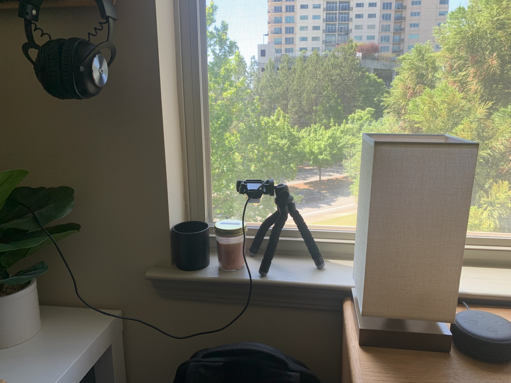
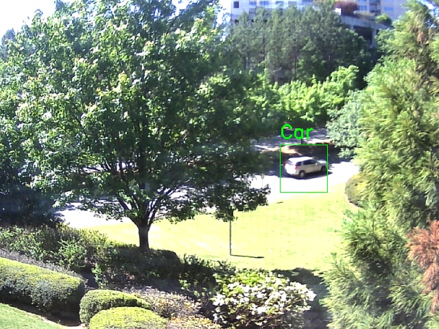
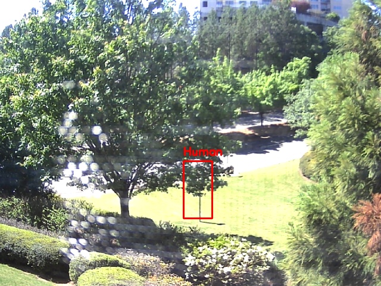

# Meadow Lane Rd Traffic Capture and Analysis
This project is aimed at collecting data on automotive and foot traffic on Meadow Lane Rd, Dunwoody, Georgia outside of my apartment window. The purpose of this project is to extend my breadth of knowledge through real-world applications of computer vision, and exercise my data analysis abilities. 

# Setup

What I used in my setup:
- 1080p USB Webcam pointed outside my window. On a tripod for some stability.
- Haar cascade object detection models. `.XML` files used can be found in `src/haarcascade_models` in this repository.
- For my setup, Python 3.8.3
- OpenCV (cv2)

# Initial Results (commit ad4ec56)
The initial results were encouraging, but proved that there were some obvious challenges to overcome. These include:
Enocuraging Results:
- Successfully detected multiple cars

Challenges:
- Sufficient data collection can only occur when there is adequate light outside and line-of-sight to the target. These are largely out of my control.
- False detection on frames occur frequently. Especially due to trees. 
- Shadows during different times of the day play an impact on how well Haar Cascade models detect shapes. Cars driving in shadows are rarely detected.
- Car paint color appears to play a part in detection. White cars are detected most often while other paint colors can vary. 
- The angle of the street from my apartment constrains the window that a car can be seen, amking future motion tracking a little more difficult to track over a wide shot. 
- Have not successfuly classified a human person yet.

